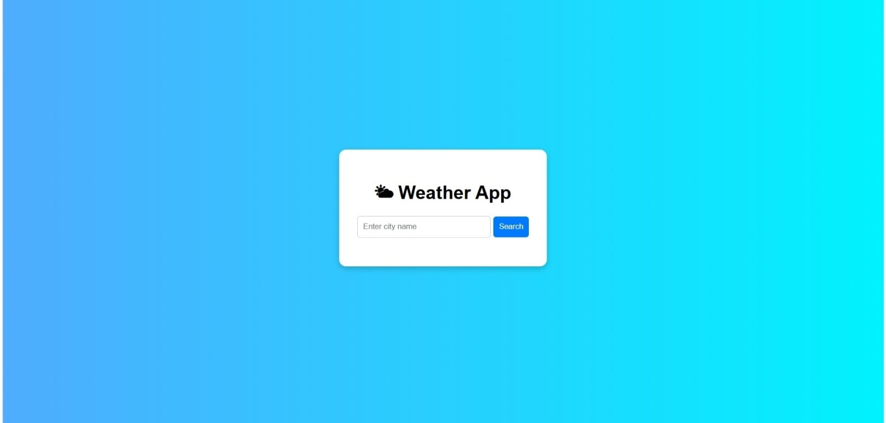

# 🌦️ Weather App

A simple and modern **Weather Application** built using **HTML, CSS, and JavaScript**.
It fetches real-time weather data using the OpenWeather API.

---

## 🚀 Features

* 🔍 Search weather by city name
* 🌡️ Temperature in Celsius
* ☁️ Weather condition (Clear, Cloudy, Rainy, etc.)
* 💧 Humidity display
* ⚡ Fast and responsive UI

---

## 📸 Screenshot Preview



> 💡 Save your app screenshot as **`screenshot.png`** in the project folder

---

## 🛠️ Technologies Used

* HTML
* CSS
* JavaScript
* OpenWeather API

---

## 🔑 API Setup

1. Go to https://openweathermap.org/api
2. Sign up and login
3. Copy your API key
4. Replace in `script.js`:

```javascript
const apiKey = "YOUR_API_KEY";
```

---

## ▶️ How to Run

1. Download or clone this project
2. Open folder in VS Code
3. Run using **Live Server** OR open `index.html`
4. Enter city name and click **Search**

---

## ⚠️ Common Issues

* ❌ "Error fetching data"
  👉 Check API key & internet connection

* ❌ "City not found"
  👉 Enter valid city name (e.g., Mumbai, Pune)

* ❌ Blank screen
  👉 Open console (F12) and check errors

---

## 📈 Future Improvements

* 🌙 Dark Mode
* 📍 Current location weather
* 📊 5-day forecast
* 🎨 Weather icons & animations

---

## 🙌 Author

**Your Name**

---

⭐ If you like this project, give it a star!
